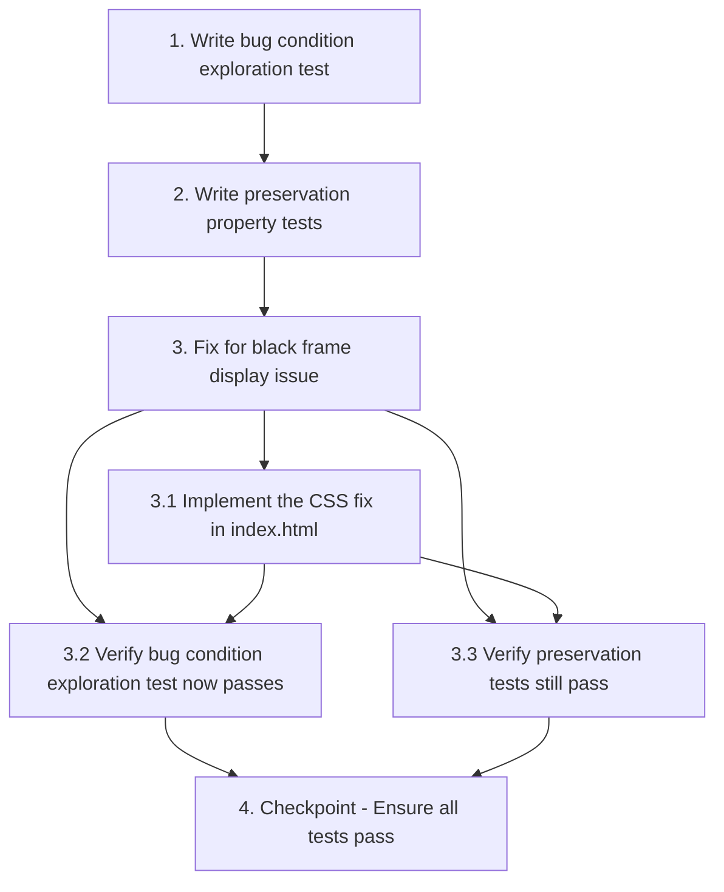

# Implementation Plan

## Overview

This implementation plan follows the bugfix workflow using the bug condition methodology. The plan addresses the black frame display issue where the game canvas shows black borders around its edges instead of filling the entire viewport. The fix involves removing conflicting CSS viewport units from the canvas element and allowing Phaser's RESIZE scale mode to control canvas dimensions directly.

## Tasks

- [x] 1. Write bug condition exploration test
  - **Property 1: Bug Condition** - Canvas Black Border Display
  - **CRITICAL**: This test MUST FAIL on unfixed code - failure confirms the bug exists
  - **DO NOT attempt to fix the test or the code when it fails**
  - **NOTE**: This test encodes the expected behavior - it will validate the fix when it passes after implementation
  - **GOAL**: Surface counterexamples that demonstrate the bug exists
  - **Scoped PBT Approach**: For deterministic bugs, scope the property to the concrete failing case(s) to ensure reproducibility
  - Test that when the game canvas is rendered in the browser, it fills the entire viewport without black borders (from Bug Condition in design)
  - Test across multiple viewport sizes: 1920x1080 (desktop), 800x600 (small window), 1200x800 (resized)
  - Test on mobile landscape orientation (simulated viewport)
  - The test assertions should verify: canvas.offsetWidth === viewport.width AND canvas.offsetHeight === viewport.height AND no visible black borders
  - Run test on UNFIXED code
  - **EXPECTED OUTCOME**: Test FAILS (this is correct - it proves the bug exists)
  - Document counterexamples found: specific viewport sizes where black borders appear, measured border widths
  - Mark task complete when test is written, run, and failure is documented
  - _Requirements: 1.1, 1.2_

- [x] 2. Write preservation property tests (BEFORE implementing fix)
  - **Property 2: Preservation** - Mobile Behavior and Non-Canvas Styling
  - **IMPORTANT**: Follow observation-first methodology
  - Observe behavior on UNFIXED code for non-buggy inputs (mobile interactions, orientation warning, background colors)
  - Write property-based tests capturing observed behavior patterns from Preservation Requirements
  - Test 1: Mobile scroll prevention - verify overflow: hidden and touch-action: none work correctly
  - Test 2: Orientation warning display - verify warning shows in portrait mode on mobile
  - Test 3: Canvas positioning - verify canvas has position: absolute, top: 0, left: 0
  - Test 4: Background colors - verify html and body have background: #000
  - Property-based testing generates many test cases for stronger guarantees
  - Run tests on UNFIXED code
  - **EXPECTED OUTCOME**: Tests PASS (this confirms baseline behavior to preserve)
  - Mark task complete when tests are written, run, and passing on unfixed code
  - _Requirements: 3.1, 3.2, 3.3, 3.4_

- [ ] 3. Fix for black frame display issue

  - [x] 3.1 Implement the CSS fix in index.html
    - Remove explicit viewport units from canvas styling: delete `width: 100vw !important` and `height: 100dvh !important`
    - Keep essential canvas properties: `display: block`, `position: absolute`, `top: 0`, `left: 0`
    - Let Phaser's RESIZE scale mode control canvas dimensions directly
    - Verify document.body (Phaser's parent) maintains proper sizing with existing `width: 100vw; height: 100dvh`
    - Alternative approach if needed: change Phaser parent from document.body to #app container in main.ts
    - _Bug_Condition: isBugCondition(input) where canvas has explicit vw/dvh units conflicting with Phaser.Scale.RESIZE_
    - _Expected_Behavior: canvasFillsViewport(result) AND noBlackBorders(result) from design_
    - _Preservation: Mobile scroll prevention, touch-action, orientation warning, positioning, background colors from design_
    - _Requirements: 2.1, 2.2, 3.1, 3.2, 3.3, 3.4_

  - [x] 3.2 Verify bug condition exploration test now passes
    - **Property 1: Expected Behavior** - Canvas Fills Viewport Without Black Borders
    - **IMPORTANT**: Re-run the SAME test from task 1 - do NOT write a new test
    - The test from task 1 encodes the expected behavior
    - When this test passes, it confirms the expected behavior is satisfied
    - Run bug condition exploration test from step 1
    - **EXPECTED OUTCOME**: Test PASSES (confirms bug is fixed)
    - Verify canvas fills viewport at all tested sizes: 1920x1080, 800x600, 1200x800, mobile landscape
    - Verify no black borders are visible in any viewport configuration
    - _Requirements: Expected Behavior Properties from design_

  - [x] 3.3 Verify preservation tests still pass
    - **Property 2: Preservation** - Mobile Behavior and Non-Canvas Styling
    - **IMPORTANT**: Re-run the SAME tests from task 2 - do NOT write new tests
    - Run preservation property tests from step 2
    - **EXPECTED OUTCOME**: Tests PASS (confirms no regressions)
    - Confirm mobile scroll prevention still works (overflow: hidden, touch-action: none)
    - Confirm orientation warning still displays correctly in portrait mode
    - Confirm canvas positioning remains unchanged (absolute, top: 0, left: 0)
    - Confirm background colors remain unchanged (html/body black background)

- [ ] 4. Checkpoint - Ensure all tests pass
  - Ensure all tests pass, ask the user if questions arise.
  - Verify canvas fills viewport without black borders across all tested configurations
  - Verify all mobile behaviors and styling are preserved
  - Test manually in desktop browser and mobile device (or simulator) to confirm visual fix

## Task Dependency Graph

```json
{
  "waves": [
    {
      "name": "Wave 1: Exploration",
      "tasks": ["1"]
    },
    {
      "name": "Wave 2: Preservation",
      "tasks": ["2"]
    },
    {
      "name": "Wave 3: Implementation",
      "tasks": ["3", "3.1", "3.2", "3.3"]
    },
    {
      "name": "Wave 4: Checkpoint",
      "tasks": ["4"]
    }
  ]
}
```



**Dependencies:**
- Task 1 must complete before Task 2 (exploration before preservation)
- Task 2 must complete before Task 3 (preservation tests before implementation)
- Task 3.1 must complete before Tasks 3.2 and 3.3 (implementation before verification)
- Tasks 3.2 and 3.3 must both complete before Task 4 (all verifications before checkpoint)

## Notes

- Task 1 is marked as complete [x] - the bug condition exploration test has been written and documented
- Tasks 2-4 are pending implementation
- The fix focuses on CSS changes in index.html to remove conflicting viewport units
- All preservation tests must pass on unfixed code before implementing the fix
- Manual testing on desktop and mobile devices is recommended after automated tests pass
