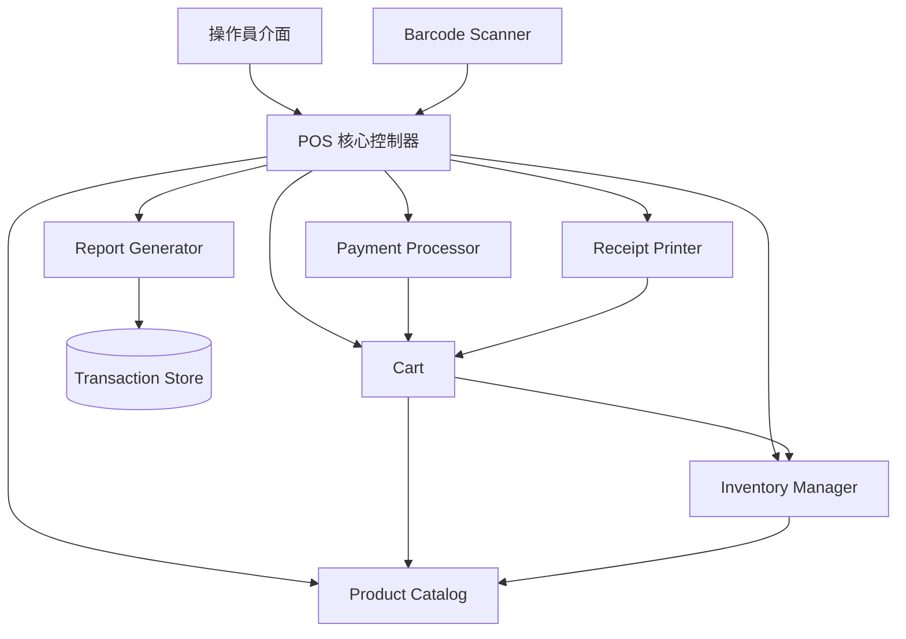

# POS 系統技術設計文件

## 概述

本設計文件描述銷售點（POS）系統的技術架構與實作方案。系統採用 TypeScript 開發，以模組化架構實現商品目錄管理、購物車操作、折扣計算、付款處理、庫存管理、收據生成、銷售報表及退貨處理等核心功能。

系統設計遵循關注點分離原則，各元件透過明確定義的介面互動，確保可測試性與可維護性。

## 架構

系統採用分層模組化架構，核心元件之間透過介面解耦：



### 設計決策

1. **TypeScript**：選用 TypeScript 提供型別安全，減少執行期錯誤
2. **In-Memory Store + 介面抽象**：資料儲存層透過介面抽象，初期使用記憶體實作，未來可替換為資料庫
3. **金額使用整數（分）**：所有金額以「分」為單位的整數儲存，避免浮點數精度問題
4. **不可變購物車操作**：購物車操作回傳新狀態，便於追蹤變更與測試

## 元件與介面

### ProductCatalog（商品目錄）

負責商品的 CRUD 操作與查詢。

```typescript
interface IProductCatalog {
  addProduct(product: ProductInput): Result<Product, CatalogError>;
  updateProduct(barcode: string, updates: Partial<ProductInput>): Result<Product, CatalogError>;
  removeProduct(barcode: string): Result<void, CatalogError>;
  findByBarcode(barcode: string): Result<Product, CatalogError>;
  searchByName(name: string): Product[];
}
```

### Cart（購物車）

管理當前交易的商品項目、數量與折扣計算。

```typescript
interface ICart {
  addItem(product: Product): Result<Cart, CartError>;
  updateItemQuantity(barcode: string, quantity: number): Result<Cart, CartError>;
  removeItem(barcode: string): Result<Cart, CartError>;
  clear(): Cart;
  applyItemDiscount(barcode: string, percent: number): Result<Cart, CartError>;
  applyTransactionDiscount(percent: number): Result<Cart, CartError>;
  getSubtotal(): number;  // 以分為單位
  getTotal(): number;     // 以分為單位
  getItems(): CartItem[];
}
```

### PaymentProcessor（付款處理器）

處理現金、信用卡及行動支付。

```typescript
interface IPaymentProcessor {
  processCashPayment(total: number, received: number): Result<PaymentResult, PaymentError>;
  processCreditCardPayment(total: number): Result<PaymentResult, PaymentError>;
  processMobilePayment(total: number): Result<PaymentResult, PaymentError>;
}
```

### InventoryManager（庫存管理器）

追蹤與更新商品庫存。

```typescript
interface IInventoryManager {
  getStock(barcode: string): Result<number, InventoryError>;
  deductStock(items: CartItem[]): Result<void, InventoryError>;
  restoreStock(items: CartItem[]): Result<void, InventoryError>;
  isInStock(barcode: string, quantity: number): boolean;
}
```

### ReceiptPrinter（收據列印器）

將交易資訊格式化為收據文字，並支援往返解析。

```typescript
interface IReceiptPrinter {
  generateReceipt(transaction: Transaction): Result<Receipt, ReceiptError>;
  formatReceipt(receipt: Receipt): string;
  parseReceipt(text: string): Result<Transaction, ReceiptError>;
}
```

### ReportGenerator（報表產生器）

根據交易記錄產生銷售報表。

```typescript
interface IReportGenerator {
  generateDailyReport(date: Date): Result<DailyReport, ReportError>;
  generateMonthlyReport(year: number, month: number): Result<MonthlyReport, ReportError>;
}
```

### POSController（POS 核心控制器）

協調各元件完成完整的銷售與退貨流程。

```typescript
interface IPOSController {
  scanBarcode(barcode: string): Result<Product, PosError>;
  checkout(paymentMethod: PaymentMethod, cashReceived?: number): Result<Transaction, PosError>;
  processReturn(transactionId: string, items: ReturnItem[]): Result<Transaction, PosError>;
}
```

## 資料模型

### Product（商品）

```typescript
interface Product {
  barcode: string;       // 唯一條碼識別碼
  name: string;          // 商品名稱
  price: number;         // 價格（以分為單位）
  category: string;      // 商品分類
  stock: number;         // 庫存數量
}

type ProductInput = Omit<Product, never>; // 新增商品時的輸入
```

### CartItem（購物車項目）

```typescript
interface CartItem {
  product: Product;
  quantity: number;
  discountPercent: number;  // 0-100，項目折扣百分比
}
```

### Cart（購物車狀態）

```typescript
interface CartState {
  items: CartItem[];
  transactionDiscountPercent: number;  // 0-100，整筆交易折扣
}
```

### Transaction（交易）

```typescript
interface Transaction {
  id: string;                    // 唯一交易編號
  items: CartItem[];             // 交易商品明細
  subtotal: number;              // 小計（分）
  transactionDiscountPercent: number;
  total: number;                 // 應付總額（分）
  paymentMethod: PaymentMethod;  // 付款方式
  cashReceived?: number;         // 現金付款時收到的金額（分）
  change?: number;               // 找零金額（分）
  timestamp: Date;               // 交易時間
  status: TransactionStatus;     // 交易狀態
  type: TransactionType;         // 交易類型（銷售/退貨）
  originalTransactionId?: string; // 退貨時的原始交易編號
}
```

### 列舉型別

```typescript
enum PaymentMethod {
  Cash = 'cash',
  CreditCard = 'credit_card',
  MobilePayment = 'mobile_payment',
}

enum TransactionStatus {
  Pending = 'pending',
  Completed = 'completed',
}

enum TransactionType {
  Sale = 'sale',
  Return = 'return',
}
```

### Receipt（收據）

```typescript
interface Receipt {
  transaction: Transaction;
  formattedText: string;
}
```

### Report（報表）

```typescript
interface ProductSalesSummary {
  barcode: string;
  name: string;
  quantitySold: number;
  totalRevenue: number;  // 分
}

interface DailyReport {
  date: Date;
  totalRevenue: number;
  transactionCount: number;
  productSales: ProductSalesSummary[];  // 依銷售數量降序排列
}

interface MonthlyReport {
  year: number;
  month: number;
  dailySummaries: DailyReport[];
  monthlyTotal: number;
}
```

### Result 型別

```typescript
type Result<T, E> = { ok: true; value: T } | { ok: false; error: E };
```

## 正確性屬性

*屬性（Property）是指在系統所有有效執行中都應成立的特徵或行為——本質上是對系統應做什麼的形式化陳述。屬性是人類可讀規格與機器可驗證正確性保證之間的橋樑。*

### 屬性 1：商品 CRUD 往返一致性

*對於任意*有效的商品輸入，將其新增至商品目錄後，以條碼查詢應回傳等價的商品物件。更新任意欄位後再次查詢，應反映更新後的值。刪除後查詢應回傳錯誤。

**驗證需求：1.1, 1.2, 1.3, 1.4**

### 屬性 2：商品搜尋正確性

*對於任意*商品目錄與任意搜尋關鍵字，以名稱搜尋回傳的所有商品，其名稱皆應包含該關鍵字；以條碼搜尋回傳的商品，其條碼應完全匹配。

**驗證需求：1.5**

### 屬性 3：購物車加入與數量管理

*對於任意*有庫存的商品與任意購物車狀態：首次加入該商品時，購物車應包含該商品且數量為 1；再次加入同一商品時，數量應增加 1；設定數量為指定值後，數量應等於該值；移除項目後，該商品不再存在於購物車中；清空後，購物車應為空。

**驗證需求：3.1, 3.2, 3.3, 3.4, 3.5**

### 屬性 4：購物車總金額不變量（含折扣）

*對於任意*購物車項目集合、任意有效的項目折扣百分比（0-100）及任意有效的交易折扣百分比（0-100），購物車小計應等於各項目 `price × quantity × (1 - itemDiscount/100)` 之和，總金額應等於 `小計 × (1 - transactionDiscount/100)`，且結果以整數（分）表示並正確取整。

**驗證需求：3.6, 4.1, 4.2, 4.3**

### 屬性 5：現金找零計算

*對於任意*應付總額與任意大於或等於總額的現金金額，找零金額應等於 `收到金額 - 應付總額`。

**驗證需求：5.2**

### 屬性 6：付款完成標記交易狀態

*對於任意*成功的付款操作（無論現金、信用卡或行動支付），交易狀態應被標記為已完成（Completed）。

**驗證需求：5.3**

### 屬性 7：未完成交易不影響庫存

*對於任意*處於未完成狀態的交易，商品目錄中所有商品的庫存數量應與交易開始前完全相同。

**驗證需求：6.2**

### 屬性 8：銷售-退貨庫存往返一致性

*對於任意*已完成的銷售交易，完成該交易後各商品庫存應減少對應的銷售數量；隨後對同一交易執行完整退貨後，各商品庫存應恢復至銷售前的數量。

**驗證需求：6.1, 9.3**

### 屬性 9：收據格式化/解析往返一致性

*對於任意*有效的 Transaction 物件，將其格式化為收據文字後再解析回 Transaction 物件，應產生與原始物件等價的結果。

**驗證需求：7.3**

### 屬性 10：收據完整性

*對於任意*已完成的交易，產生的收據文字應包含所有購物車項目的名稱與數量、各項折扣金額、總金額、付款方式及交易時間。

**驗證需求：7.1**

### 屬性 11：報表彙總與排序正確性

*對於任意*交易記錄集合與任意指定日期，日報表的銷售總額應等於該日所有已完成交易的總金額之和，交易筆數應等於該日交易數量，且商品銷售明細應依銷售數量由高到低排序。月報表的月度總計應等於各日報表銷售總額之和。

**驗證需求：8.1, 8.2, 8.3**

### 屬性 12：退貨交易退款金額正確性

*對於任意*已完成的原始銷售交易與任意退貨項目子集，建立的退貨交易之退款金額應等於所選退貨項目的原始銷售金額（含折扣）之和。

**驗證需求：9.2**

## 錯誤處理

系統使用 `Result<T, E>` 型別統一處理錯誤，避免拋出例外。各元件定義專屬的錯誤型別：

### 錯誤型別定義

```typescript
type CatalogError = 
  | { type: 'PRODUCT_NOT_FOUND'; barcode: string }
  | { type: 'DUPLICATE_BARCODE'; barcode: string };

type CartError =
  | { type: 'ITEM_NOT_FOUND'; barcode: string }
  | { type: 'INSUFFICIENT_STOCK'; barcode: string; available: number; requested: number }
  | { type: 'INVALID_QUANTITY'; quantity: number }
  | { type: 'INVALID_DISCOUNT'; percent: number };

type PaymentError =
  | { type: 'INSUFFICIENT_CASH'; total: number; received: number }
  | { type: 'PAYMENT_FAILED'; reason: string };

type InventoryError =
  | { type: 'PRODUCT_NOT_FOUND'; barcode: string }
  | { type: 'INSUFFICIENT_STOCK'; barcode: string };

type ReceiptError =
  | { type: 'FORMAT_ERROR'; reason: string }
  | { type: 'PARSE_ERROR'; reason: string };

type ReportError =
  | { type: 'INVALID_DATE'; reason: string };

type PosError =
  | { type: 'PRODUCT_NOT_FOUND'; barcode: string }
  | { type: 'TRANSACTION_NOT_FOUND'; transactionId: string }
  | { type: 'ALREADY_RETURNED'; transactionId: string }
  | { type: 'CART_EMPTY' }
  | CatalogError | CartError | PaymentError;
```

### 錯誤處理策略

| 情境 | 處理方式 |
|------|---------|
| 重複條碼新增 | 回傳 `DUPLICATE_BARCODE` 錯誤，不修改目錄 |
| 商品不存在 | 回傳 `PRODUCT_NOT_FOUND` 錯誤 |
| 庫存不足 | 回傳 `INSUFFICIENT_STOCK` 錯誤，不修改購物車 |
| 無效折扣百分比 | 回傳 `INVALID_DISCOUNT` 錯誤，不套用折扣 |
| 現金不足 | 回傳 `INSUFFICIENT_CASH` 錯誤，交易保持未完成 |
| 付款處理失敗 | 回傳 `PAYMENT_FAILED` 錯誤，交易保持未完成 |
| 交易編號不存在 | 回傳 `TRANSACTION_NOT_FOUND` 錯誤 |
| 重複退貨 | 回傳 `ALREADY_RETURNED` 錯誤，不建立退貨交易 |
| 收據解析失敗 | 回傳 `PARSE_ERROR` 錯誤，記錄錯誤日誌 |
| 無銷售記錄期間 | 回傳空報表，附帶「該期間無銷售記錄」訊息 |

## 測試策略

### 雙軌測試方法

系統採用單元測試與屬性測試並行的策略，確保全面覆蓋。

### 屬性測試（Property-Based Testing）

- **測試框架**：使用 [fast-check](https://github.com/dubzzz/fast-check) 作為 TypeScript 屬性測試庫
- **每個屬性測試至少執行 100 次迭代**
- **每個測試須以註解標記對應的設計屬性**
- 標記格式：`Feature: pos-system, Property {number}: {property_text}`
- **每個正確性屬性由一個屬性測試實作**

### 屬性測試對應表

| 屬性 | 測試描述 | 產生器 |
|------|---------|--------|
| 屬性 1 | 商品 CRUD 往返 | 隨機商品輸入（名稱、價格、條碼、分類、庫存） |
| 屬性 2 | 搜尋正確性 | 隨機商品集合 + 隨機搜尋關鍵字 |
| 屬性 3 | 購物車加入與數量管理 | 隨機商品 + 隨機操作序列（加入/修改/移除/清空） |
| 屬性 4 | 購物車總金額不變量 | 隨機購物車項目 + 隨機折扣百分比 (0-100) |
| 屬性 5 | 現金找零計算 | 隨機總額 + 隨機現金金額 (≥ 總額) |
| 屬性 6 | 付款完成狀態 | 隨機付款方式 + 隨機有效金額 |
| 屬性 7 | 未完成交易庫存不變 | 隨機商品集合 + 隨機購物車 |
| 屬性 8 | 銷售-退貨庫存往返 | 隨機交易 + 完整退貨 |
| 屬性 9 | 收據格式化/解析往返 | 隨機 Transaction 物件 |
| 屬性 10 | 收據完整性 | 隨機 Transaction 物件 |
| 屬性 11 | 報表彙總與排序 | 隨機交易記錄集合 + 隨機日期 |
| 屬性 12 | 退貨退款金額 | 隨機已完成交易 + 隨機退貨項目子集 |

### 單元測試

單元測試聚焦於具體範例、邊界案例與錯誤條件：

- **邊界案例**：庫存為 0 時加入購物車、重複條碼新增、無效折扣百分比、現金不足、不存在的條碼/交易編號、重複退貨、空報表期間
- **具體範例**：三種付款方式各一個成功案例、收據格式化輸出驗證
- **整合測試**：完整銷售流程（掃描→加入購物車→折扣→付款→庫存更新→收據）、完整退貨流程

### 測試執行

- 測試框架：Vitest
- 屬性測試庫：fast-check
- 執行指令：`vitest --run`
