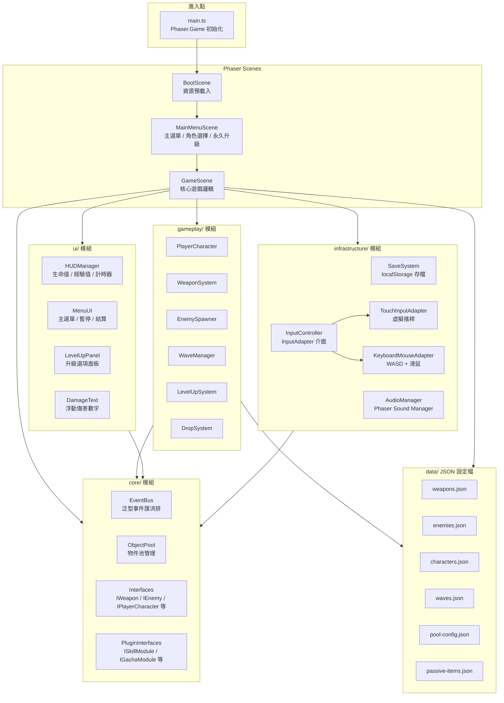
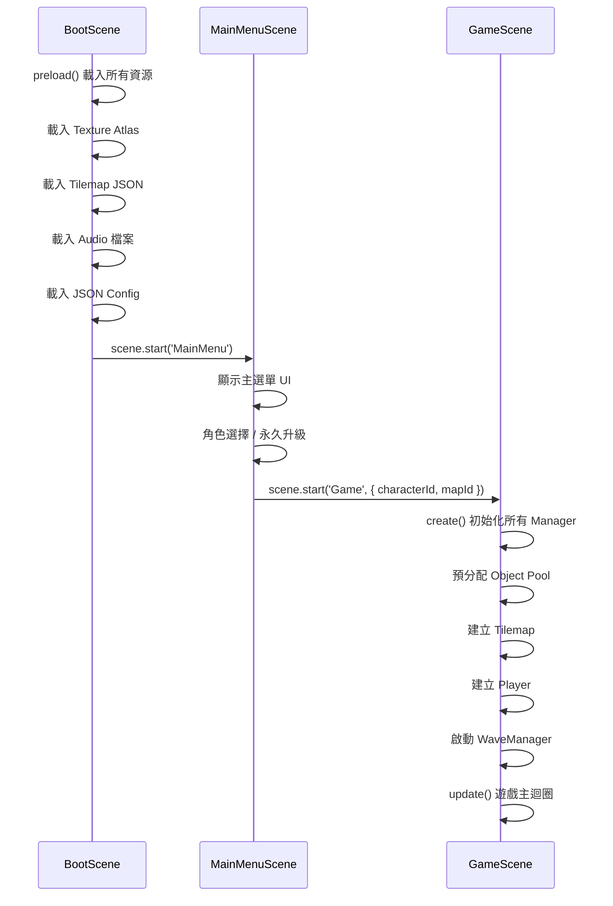
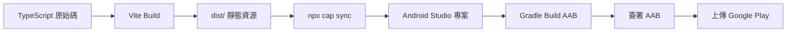

# 技術設計文件

## 概覽

本文件描述「吸血鬼倖存者」類 Roguelike 生存手遊的 Web 版技術架構設計。遊戲使用 Phaser.js 3 遊戲引擎搭配 TypeScript 開發，以 Vite 作為建置工具，最終透過 Capacitor 包裝為 Android App。架構以模組化、可擴充性與效能優化為核心設計原則，採用 TypeScript 介面抽象、JSON 資料驅動、Object Pooling 與事件匯流排等設計模式。

技術棧：
- **遊戲引擎**：Phaser.js 3（WebGL 2D 渲染）
- **程式語言**：TypeScript（strict mode）
- **建置工具**：Vite 5+（HMR 開發、Terser 壓縮生產版本）
- **行動端包裝**：Capacitor 5+（Android WebView）
- **存檔機制**：localStorage（瀏覽器與 Capacitor WebView 共用）
- **測試框架**：Vitest + fast-check（屬性測試）

## 架構

### 模組化架構圖



### 模組相依性規則

| 模組 | 命名空間 | 職責 | 可引用 |
|------|---------|------|--------|
| `core/` | 介面、事件、物件池、工具 | 定義所有抽象介面與共用基礎設施 | 無（最底層） |
| `gameplay/` | 武器、敵人、升級、波次、掉落 | 遊戲核心邏輯 | `core/` |
| `ui/` | HUD、選單、面板 | 所有 UI 元素 | `core/` |
| `infrastructure/` | 存檔、音效、輸入、建置 | 平台相關功能 | `core/` |
| `scenes/` | Phaser Scene 定義 | 場景生命週期管理 | 全部模組 |
| `data/` | JSON 設定檔 | 遊戲資料定義 | 被所有模組讀取 |

## 元件與介面

### 專案目錄結構

```
project-root/
├── src/
│   ├── main.ts                          # Phaser.Game 初始化入口
│   ├── core/
│   │   ├── interfaces/
│   │   │   ├── IWeapon.ts
│   │   │   ├── IEnemy.ts
│   │   │   ├── IPlayerCharacter.ts
│   │   │   ├── IPassiveItem.ts
│   │   │   ├── IInputAdapter.ts
│   │   │   ├── ISaveProvider.ts
│   │   │   └── index.ts
│   │   ├── events/
│   │   │   ├── EventBus.ts
│   │   │   └── GameEvents.ts
│   │   ├── pool/
│   │   │   ├── ObjectPool.ts
│   │   │   └── PoolStats.ts
│   │   ├── plugin-interfaces/
│   │   │   └── index.ts                 # ISkillModule, IGachaModule 等
│   │   └── index.ts
│   ├── gameplay/
│   │   ├── player/
│   │   │   └── PlayerCharacter.ts
│   │   ├── weapons/
│   │   │   ├── WeaponSystem.ts
│   │   │   └── weapons/                 # 各武器實作
│   │   ├── enemies/
│   │   │   ├── EnemySpawner.ts
│   │   │   └── EnemyBase.ts
│   │   ├── level-up/
│   │   │   └── LevelUpSystem.ts
│   │   ├── wave/
│   │   │   └── WaveManager.ts
│   │   └── drop/
│   │       └── DropSystem.ts
│   ├── ui/
│   │   ├── hud/
│   │   │   ├── HUDManager.ts
│   │   │   └── DamageTextManager.ts
│   │   ├── menus/
│   │   │   ├── MainMenuUI.ts
│   │   │   ├── PauseMenuUI.ts
│   │   │   └── GameOverUI.ts
│   │   └── level-up/
│   │       └── LevelUpPanelUI.ts
│   ├── infrastructure/
│   │   ├── save/
│   │   │   ├── SaveSystem.ts
│   │   │   └── LocalStorageSaveProvider.ts
│   │   ├── audio/
│   │   │   └── AudioManager.ts
│   │   └── input/
│   │       ├── InputController.ts
│   │       ├── TouchInputAdapter.ts
│   │       └── KeyboardMouseAdapter.ts
│   ├── scenes/
│   │   ├── BootScene.ts
│   │   ├── MainMenuScene.ts
│   │   └── GameScene.ts
│   └── data/
│       ├── weapons.json
│       ├── enemies.json
│       ├── characters.json
│       ├── waves.json
│       ├── passive-items.json
│       └── pool-config.json
├── public/
│   ├── index.html
│   └── assets/
│       ├── sprites/                     # Texture Atlas PNG + JSON
│       ├── tilemaps/                    # Tiled JSON + Tileset PNG
│       ├── audio/
│       │   ├── bgm/
│       │   └── sfx/
│       └── fonts/
├── tests/
│   ├── unit/
│   └── property/
├── index.html
├── vite.config.ts
├── tsconfig.json
├── capacitor.config.ts
└── package.json
```

### 核心 TypeScript 介面定義

```typescript
// === core/interfaces/IWeapon.ts ===
import { WeaponConfig, WeaponLevelData } from '../../data/types';

export interface IWeapon {
  readonly id: string;
  readonly config: WeaponConfig;
  level: number;
  readonly maxLevel: number;

  attack(origin: Phaser.Math.Vector2, direction: Phaser.Math.Vector2): void;
  levelUp(): void;
  canEvolve(passives: ReadonlyArray<IPassiveItem>): boolean;
  evolve(): IWeapon;
  getLevelData(): WeaponLevelData;
  destroy(): void;
}
```

```typescript
// === core/interfaces/IEnemy.ts ===
import { EnemyConfig } from '../../data/types';

export interface IEnemy {
  readonly id: string;
  readonly config: EnemyConfig;
  currentHP: number;
  readonly sprite: Phaser.GameObjects.Sprite;

  takeDamage(damage: number): void;
  setTarget(target: Phaser.Math.Vector2): void;
  activate(x: number, y: number, statMultiplier: number): void;
  deactivate(): void;
  update(delta: number): void;
}
```

```typescript
// === core/interfaces/IPlayerCharacter.ts ===
import { CharacterConfig, StatModifier } from '../../data/types';

export interface IPlayerCharacter {
  readonly config: CharacterConfig;
  currentHP: number;
  maxHP: number;
  readonly position: Phaser.Math.Vector2;
  readonly sprite: Phaser.GameObjects.Sprite;

  move(direction: Phaser.Math.Vector2): void;
  takeDamage(damage: number): void;
  applyStatModifier(modifier: StatModifier): void;
  removeStatModifier(modifier: StatModifier): void;
  getEffectiveStat(statName: string): number;
}
```

```typescript
// === core/interfaces/IPassiveItem.ts ===
import { PassiveItemConfig, StatModifier } from '../../data/types';

export interface IPassiveItem {
  readonly id: string;
  readonly config: PassiveItemConfig;
  level: number;
  readonly maxLevel: number;

  getModifier(): StatModifier;
  levelUp(): void;
}
```

```typescript
// === core/interfaces/IInputAdapter.ts ===
export interface IInputAdapter {
  getMovementInput(): Phaser.Math.Vector2;
  isPointerDown(): boolean;
  getPointerPosition(): Phaser.Math.Vector2;
  update(delta: number): void;
  destroy(): void;
}
```

```typescript
// === core/interfaces/ISaveProvider.ts ===
export interface ISaveProvider {
  save(key: string, jsonData: string): void;
  load(key: string): string | null;
  delete(key: string): void;
  exists(key: string): boolean;
}
```

### 預留模組介面（Plugin System）

```typescript
// === core/plugin-interfaces/index.ts ===
export interface ISkillModule { registerSkills(): void; }
export interface IEquipmentModule { registerEquipment(): void; }
export interface IGachaModule { openGachaBanner(): void; }
export interface IQuestModule { loadQuests(): void; }
export interface IAdModule { showRewardedAd(onComplete: () => void): void; }
export interface IIAPModule { purchaseProduct(productId: string, onResult: (success: boolean) => void): void; }
```

### 事件匯流排設計

```typescript
// === core/events/EventBus.ts ===
type EventHandler<T> = (event: T) => void;

export class EventBus {
  private handlers: Map<string, Set<EventHandler<any>>> = new Map();

  on<T>(eventName: string, handler: EventHandler<T>): void {
    if (!this.handlers.has(eventName)) {
      this.handlers.set(eventName, new Set());
    }
    this.handlers.get(eventName)!.add(handler);
  }

  off<T>(eventName: string, handler: EventHandler<T>): void {
    this.handlers.get(eventName)?.delete(handler);
  }

  emit<T>(eventName: string, event: T): void {
    this.handlers.get(eventName)?.forEach(handler => handler(event));
  }

  clear(): void {
    this.handlers.clear();
  }
}

// 全域單例
export const eventBus = new EventBus();
```

```typescript
// === core/events/GameEvents.ts ===
export interface EnemyKilledEvent {
  position: { x: number; y: number };
  enemyId: string;
  xpValue: number;
}

export interface PlayerLevelUpEvent {
  newLevel: number;
}

export interface PlayerDamagedEvent {
  damage: number;
  remainingHP: number;
}

export interface GameOverEvent {
  survivalTime: number;
  killCount: number;
  gold: number;
  maxLevel: number;
}

export interface GameVictoryEvent {
  survivalTime: number;
  killCount: number;
  gold: number;
}

export interface XPCollectedEvent {
  amount: number;
}

export interface WeaponEvolvedEvent {
  weaponId: string;
  evolvedWeaponId: string;
}

export interface WaveChangedEvent {
  waveIndex: number;
  difficultyMultiplier: number;
}

// 事件名稱常數
export const GameEventNames = {
  ENEMY_KILLED: 'enemy:killed',
  PLAYER_LEVEL_UP: 'player:levelUp',
  PLAYER_DAMAGED: 'player:damaged',
  GAME_OVER: 'game:over',
  GAME_VICTORY: 'game:victory',
  XP_COLLECTED: 'xp:collected',
  WEAPON_EVOLVED: 'weapon:evolved',
  WAVE_CHANGED: 'wave:changed',
  GAME_PAUSED: 'game:paused',
  GAME_RESUMED: 'game:resumed',
} as const;
```

### Object Pool 系統設計

```typescript
// === core/pool/ObjectPool.ts ===
export interface PoolConfig {
  poolId: string;
  preAllocateCount: number;
  maxBatchExpansion: number; // 上限 10
}

export interface PoolableObject {
  activate(x: number, y: number, ...args: any[]): void;
  deactivate(): void;
  readonly gameObject: Phaser.GameObjects.GameObject;
}

export class ObjectPool<T extends PoolableObject> {
  private available: T[] = [];
  private active: Set<T> = new Set();
  private stats: PoolStats;
  private factory: () => T;
  private config: PoolConfig;

  constructor(config: PoolConfig, factory: () => T) {
    this.config = config;
    this.factory = factory;
    this.stats = { preAllocated: 0, currentActive: 0, peakActive: 0, totalExpansions: 0 };
  }

  preAllocate(): void {
    for (let i = 0; i < this.config.preAllocateCount; i++) {
      const obj = this.factory();
      obj.deactivate();
      this.available.push(obj);
    }
    this.stats.preAllocated = this.config.preAllocateCount;
  }

  spawn(x: number, y: number, ...args: any[]): T {
    if (this.available.length === 0) {
      this.expand();
    }
    const obj = this.available.pop()!;
    obj.activate(x, y, ...args);
    this.active.add(obj);
    this.stats.currentActive = this.active.size;
    if (this.active.size > this.stats.peakActive) {
      this.stats.peakActive = this.active.size;
    }
    return obj;
  }

  despawn(obj: T): void {
    obj.deactivate();
    this.active.delete(obj);
    this.available.push(obj);
    this.stats.currentActive = this.active.size;
  }

  private expand(): void {
    const batchSize = Math.min(this.config.maxBatchExpansion, 10);
    for (let i = 0; i < batchSize; i++) {
      const obj = this.factory();
      obj.deactivate();
      this.available.push(obj);
    }
    this.stats.totalExpansions++;
  }

  getStats(): PoolStats {
    return { ...this.stats };
  }

  getActiveObjects(): ReadonlySet<T> {
    return this.active;
  }

  clear(): void {
    this.active.forEach(obj => obj.deactivate());
    this.active.clear();
    this.available = [];
    this.stats.currentActive = 0;
  }
}
```

```typescript
// === core/pool/PoolStats.ts ===
export interface PoolStats {
  preAllocated: number;
  currentActive: number;
  peakActive: number;
  totalExpansions: number;
}
```

### Object Pool 管理器

```typescript
// === core/pool/ObjectPoolManager.ts ===
import { ObjectPool, PoolableObject, PoolConfig } from './ObjectPool';
import { PoolStats } from './PoolStats';

export class ObjectPoolManager {
  private pools: Map<string, ObjectPool<any>> = new Map();

  register<T extends PoolableObject>(
    config: PoolConfig,
    factory: () => T
  ): ObjectPool<T> {
    const pool = new ObjectPool<T>(config, factory);
    pool.preAllocate();
    this.pools.set(config.poolId, pool);
    return pool;
  }

  getPool<T extends PoolableObject>(poolId: string): ObjectPool<T> {
    const pool = this.pools.get(poolId);
    if (!pool) throw new Error(`Pool not found: ${poolId}`);
    return pool as ObjectPool<T>;
  }

  getAllStats(): Map<string, PoolStats> {
    const result = new Map<string, PoolStats>();
    this.pools.forEach((pool, id) => result.set(id, pool.getStats()));
    return result;
  }

  clearAll(): void {
    this.pools.forEach(pool => pool.clear());
  }
}
```

### 物件池使用對照表

| 物件類型 | Pool ID | 預分配數量 | 批次擴容上限 |
|---------|---------|-----------|------------|
| 一般敵人 | `enemy_normal` | 50 | 10 |
| Boss 敵人 | `enemy_boss` | 2 | 1 |
| 投射物 | `projectile` | 100 | 10 |
| 經驗寶石 | `xp_gem` | 80 | 10 |
| 道具掉落 | `item_drop` | 20 | 5 |
| 傷害數字 | `damage_text` | 30 | 10 |
| 特效 | `vfx` | 40 | 10 |


### Phaser Scene 結構



#### BootScene

```typescript
// === scenes/BootScene.ts ===
export class BootScene extends Phaser.Scene {
  constructor() { super({ key: 'Boot' }); }

  preload(): void {
    // 顯示載入進度條
    this.createLoadingBar();

    // 載入 Texture Atlas（Sprite Atlas）
    this.load.atlas('game-atlas', 'assets/sprites/game-atlas.png', 'assets/sprites/game-atlas.json');

    // 載入 Tilemap
    this.load.tilemapTiledJSON('map-forest', 'assets/tilemaps/forest.json');
    this.load.tilemapTiledJSON('map-cemetery', 'assets/tilemaps/cemetery.json');
    this.load.image('tileset-forest', 'assets/tilemaps/tileset-forest.png');
    this.load.image('tileset-cemetery', 'assets/tilemaps/tileset-cemetery.png');

    // 載入音效
    this.load.audio('bgm-forest', 'assets/audio/bgm/forest.mp3');
    this.load.audio('bgm-cemetery', 'assets/audio/bgm/cemetery.mp3');
    // ... 其他音效

    // 載入 JSON 設定檔
    this.load.json('weapons-config', 'assets/data/weapons.json');
    this.load.json('enemies-config', 'assets/data/enemies.json');
    this.load.json('characters-config', 'assets/data/characters.json');
    this.load.json('waves-config', 'assets/data/waves.json');
    this.load.json('pool-config', 'assets/data/pool-config.json');
    this.load.json('passive-items-config', 'assets/data/passive-items.json');
  }

  create(): void {
    this.scene.start('MainMenu');
  }

  private createLoadingBar(): void {
    const { width, height } = this.scale;
    const bar = this.add.graphics();
    this.load.on('progress', (value: number) => {
      bar.clear();
      bar.fillStyle(0xffffff, 1);
      bar.fillRect(width * 0.1, height / 2, width * 0.8 * value, 30);
    });
  }
}
```

#### MainMenuScene

```typescript
// === scenes/MainMenuScene.ts ===
export class MainMenuScene extends Phaser.Scene {
  constructor() { super({ key: 'MainMenu' }); }

  create(): void {
    // 從 SaveSystem 讀取存檔
    // 顯示主選單按鈕：開始遊戲、角色選擇、永久升級、設定
    // 顯示版本號
  }
}
```

#### GameScene

```typescript
// === scenes/GameScene.ts ===
export class GameScene extends Phaser.Scene {
  // Manager 實例
  private poolManager!: ObjectPoolManager;
  private inputController!: InputController;
  private weaponSystem!: WeaponSystem;
  private enemySpawner!: EnemySpawner;
  private waveManager!: WaveManager;
  private levelUpSystem!: LevelUpSystem;
  private dropSystem!: DropSystem;
  private hudManager!: HUDManager;
  private audioManager!: AudioManager;

  // 遊戲狀態
  private gameTime: number = 0;
  private killCount: number = 0;
  private gameState: GameState = GameState.Playing;
  private player!: PlayerCharacter;

  constructor() { super({ key: 'Game' }); }

  create(data: { characterId: string; mapId: string }): void {
    // 1. 建立 Tilemap
    // 2. 初始化 ObjectPoolManager 並預分配
    // 3. 建立 Player
    // 4. 初始化 InputController（依平台選擇 Adapter）
    // 5. 初始化各 Manager
    // 6. 設定攝影機跟隨
    // 7. 設定物理碰撞
    // 8. 啟動 WaveManager
    // 9. 初始化 HUD
    // 10. 播放 BGM
  }

  update(time: number, delta: number): void {
    if (this.gameState !== GameState.Playing) return;

    this.gameTime += delta / 1000;
    this.inputController.update(delta);
    this.player.update(delta);
    this.weaponSystem.update(delta);
    this.enemySpawner.update(delta);
    this.waveManager.update(delta, this.gameTime);
    this.dropSystem.update(delta);
    this.hudManager.update(this.gameTime, this.killCount);

    // 螢幕外敵人跳幀更新（效能優化）
    this.updateOffscreenEnemies(delta);
  }

  private updateOffscreenEnemies(delta: number): void {
    // 當場上敵人 > 100 時，螢幕外敵人每 2 幀更新一次
  }
}

export enum GameState {
  Playing = 'playing',
  Paused = 'paused',
  LevelUp = 'levelUp',
  GameOver = 'gameOver',
  Victory = 'victory',
}
```

### 輸入適配器設計

```typescript
// === infrastructure/input/InputController.ts ===
export class InputController {
  private adapter: IInputAdapter;

  constructor(scene: Phaser.Scene) {
    // 依據平台自動選擇適配器
    if ('ontouchstart' in window || navigator.maxTouchPoints > 0) {
      this.adapter = new TouchInputAdapter(scene);
    } else {
      this.adapter = new KeyboardMouseAdapter(scene);
    }
  }

  getMovement(): Phaser.Math.Vector2 {
    return this.adapter.getMovementInput();
  }

  update(delta: number): void {
    this.adapter.update(delta);
  }

  destroy(): void {
    this.adapter.destroy();
  }
}
```

```typescript
// === infrastructure/input/TouchInputAdapter.ts ===
export class TouchInputAdapter implements IInputAdapter {
  private scene: Phaser.Scene;
  private joystickBase!: Phaser.GameObjects.Image;
  private joystickThumb!: Phaser.GameObjects.Image;
  private joystickRadius: number = 60;
  private deadZoneRatio: number = 0.15;
  private direction: Phaser.Math.Vector2 = new Phaser.Math.Vector2(0, 0);
  private isActive: boolean = false;
  private pointerId: number = -1;

  constructor(scene: Phaser.Scene) {
    this.scene = scene;
    this.createJoystick();
    this.setupTouchListeners();
  }

  getMovementInput(): Phaser.Math.Vector2 {
    return this.direction;
  }

  isPointerDown(): boolean {
    return this.isActive;
  }

  getPointerPosition(): Phaser.Math.Vector2 {
    const pointer = this.scene.input.activePointer;
    return new Phaser.Math.Vector2(pointer.x, pointer.y);
  }

  update(_delta: number): void {
    // 搖桿位置更新在觸控事件中處理
  }

  destroy(): void {
    this.joystickBase?.destroy();
    this.joystickThumb?.destroy();
  }

  private createJoystick(): void {
    this.joystickBase = this.scene.add.image(0, 0, 'game-atlas', 'joystick-base')
      .setScrollFactor(0).setDepth(1000).setAlpha(0.5).setVisible(false);
    this.joystickThumb = this.scene.add.image(0, 0, 'game-atlas', 'joystick-thumb')
      .setScrollFactor(0).setDepth(1001).setAlpha(0.7).setVisible(false);
  }

  private setupTouchListeners(): void {
    this.scene.input.on('pointerdown', (pointer: Phaser.Input.Pointer) => {
      // 僅左半螢幕觸發搖桿
      if (pointer.x < this.scene.scale.width / 2 && !this.isActive) {
        this.isActive = true;
        this.pointerId = pointer.id;
        this.joystickBase.setPosition(pointer.x, pointer.y).setVisible(true);
        this.joystickThumb.setPosition(pointer.x, pointer.y).setVisible(true);
      }
    });

    this.scene.input.on('pointermove', (pointer: Phaser.Input.Pointer) => {
      if (this.isActive && pointer.id === this.pointerId) {
        const dx = pointer.x - this.joystickBase.x;
        const dy = pointer.y - this.joystickBase.y;
        const distance = Math.sqrt(dx * dx + dy * dy);

        // 死區判定
        if (distance < this.joystickRadius * this.deadZoneRatio) {
          this.direction.set(0, 0);
          this.joystickThumb.setPosition(this.joystickBase.x, this.joystickBase.y);
          return;
        }

        // 限制搖桿範圍
        const clampedDist = Math.min(distance, this.joystickRadius);
        const angle = Math.atan2(dy, dx);
        this.joystickThumb.setPosition(
          this.joystickBase.x + Math.cos(angle) * clampedDist,
          this.joystickBase.y + Math.sin(angle) * clampedDist
        );
        this.direction.set(Math.cos(angle), Math.sin(angle)).normalize();
      }
    });

    this.scene.input.on('pointerup', (pointer: Phaser.Input.Pointer) => {
      if (pointer.id === this.pointerId) {
        this.isActive = false;
        this.pointerId = -1;
        this.direction.set(0, 0);
        this.joystickBase.setVisible(false);
        this.joystickThumb.setVisible(false);
      }
    });
  }
}
```

```typescript
// === infrastructure/input/KeyboardMouseAdapter.ts ===
export class KeyboardMouseAdapter implements IInputAdapter {
  private scene: Phaser.Scene;
  private cursors!: { W: Phaser.Input.Keyboard.Key; A: Phaser.Input.Keyboard.Key;
                      S: Phaser.Input.Keyboard.Key; D: Phaser.Input.Keyboard.Key };
  private direction: Phaser.Math.Vector2 = new Phaser.Math.Vector2(0, 0);

  constructor(scene: Phaser.Scene) {
    this.scene = scene;
    this.cursors = {
      W: scene.input.keyboard!.addKey(Phaser.Input.Keyboard.KeyCodes.W),
      A: scene.input.keyboard!.addKey(Phaser.Input.Keyboard.KeyCodes.A),
      S: scene.input.keyboard!.addKey(Phaser.Input.Keyboard.KeyCodes.S),
      D: scene.input.keyboard!.addKey(Phaser.Input.Keyboard.KeyCodes.D),
    };
  }

  getMovementInput(): Phaser.Math.Vector2 {
    return this.direction;
  }

  isPointerDown(): boolean {
    return this.scene.input.activePointer.isDown;
  }

  getPointerPosition(): Phaser.Math.Vector2 {
    const pointer = this.scene.input.activePointer;
    return new Phaser.Math.Vector2(pointer.worldX, pointer.worldY);
  }

  update(_delta: number): void {
    let x = 0, y = 0;
    if (this.cursors.W.isDown) y -= 1;
    if (this.cursors.S.isDown) y += 1;
    if (this.cursors.A.isDown) x -= 1;
    if (this.cursors.D.isDown) x += 1;

    if (x !== 0 || y !== 0) {
      this.direction.set(x, y).normalize();
    } else {
      this.direction.set(0, 0);
    }
  }

  destroy(): void {
    // Phaser 會自動清理鍵盤監聽
  }
}
```

### 存檔系統設計

```typescript
// === infrastructure/save/SaveSystem.ts ===
export interface SaveData {
  gold: number;
  permanentUpgradeLevels: number[];  // 5 種永久升級的等級
  unlockedCharacterIds: string[];
  settings: {
    musicVolume: number;   // 0-1
    sfxVolume: number;     // 0-1
  };
  appVersion: string;
}

export class SaveSystem {
  private provider: ISaveProvider;
  private static readonly SAVE_KEY = 'vampire_survivors_save';

  constructor(provider: ISaveProvider) {
    this.provider = provider;
  }

  save(data: SaveData): void {
    const json = JSON.stringify(data);
    this.provider.save(SaveSystem.SAVE_KEY, json);
  }

  load(): SaveData {
    if (!this.provider.exists(SaveSystem.SAVE_KEY)) {
      return this.createDefault();
    }
    try {
      const json = this.provider.load(SaveSystem.SAVE_KEY);
      if (!json) return this.createDefault();
      return JSON.parse(json) as SaveData;
    } catch {
      // 存檔損毀，建立預設存檔
      const defaultSave = this.createDefault();
      this.save(defaultSave);
      return defaultSave;
    }
  }

  createDefault(): SaveData {
    return {
      gold: 0,
      permanentUpgradeLevels: [0, 0, 0, 0, 0],
      unlockedCharacterIds: ['char_default'],
      settings: { musicVolume: 0.7, sfxVolume: 1.0 },
      appVersion: '1.0.0',
    };
  }
}
```

```typescript
// === infrastructure/save/LocalStorageSaveProvider.ts ===
export class LocalStorageSaveProvider implements ISaveProvider {
  save(key: string, jsonData: string): void {
    localStorage.setItem(key, jsonData);
  }

  load(key: string): string | null {
    return localStorage.getItem(key);
  }

  delete(key: string): void {
    localStorage.removeItem(key);
  }

  exists(key: string): boolean {
    return localStorage.getItem(key) !== null;
  }
}
```

## 資料模型

### JSON 設定檔結構

所有遊戲實體的屬性透過 JSON 設定檔定義，取代 Unity ScriptableObject，實現資料與邏輯分離。

#### TypeScript 資料型別定義

```typescript
// === data/types.ts ===

// 武器設定
export interface WeaponConfig {
  weaponId: string;
  displayName: string;
  atlasFrame: string;          // Texture Atlas 中的 frame 名稱
  projectileFrame: string;
  baseDamage: number;
  attackInterval: number;      // 秒
  attackRange: number;         // 像素
  maxLevel: number;            // 固定 8
  attackPattern: 'projectile' | 'area' | 'orbit' | 'homing' | 'chain' | 'random';
  levelData: WeaponLevelData[];
  evolutionPassiveId: string;  // 進化所需被動道具 ID
  evolvedWeaponId: string;     // 進化後武器 ID
}

export interface WeaponLevelData {
  level: number;
  damage: number;
  projectileCount: number;
  attackRange: number;
  attackInterval: number;
  description: string;
}

// 敵人設定
export interface EnemyConfig {
  enemyId: string;
  displayName: string;
  atlasFrame: string;
  baseHP: number;
  baseDamage: number;
  moveSpeed: number;           // 像素/秒
  bodySize: number;            // 碰撞半徑
  xpValue: number;
  isBoss: boolean;
  dropTable: DropTableEntry[];
}

export interface DropTableEntry {
  itemId: string;
  dropRate: number;            // 0-1 機率
}

// 角色設定
export interface CharacterConfig {
  characterId: string;
  displayName: string;
  atlasFrame: string;
  baseHP: number;
  baseMoveSpeed: number;       // 像素/秒
  baseAttackPower: number;     // 攻擊力倍率
  basePickupRange: number;     // 像素
  startingWeaponId: string;
  unlockedByDefault: boolean;
  unlockCost: number;
}

// 被動道具設定
export interface PassiveItemConfig {
  itemId: string;
  displayName: string;
  atlasFrame: string;
  maxLevel: number;            // 固定 8
  levelData: PassiveItemLevelData[];
}

export interface PassiveItemLevelData {
  level: number;
  statModifiers: StatModifier[];
  description: string;
}

// 屬性修改器
export interface StatModifier {
  stat: StatType;
  value: number;
  type: 'flat' | 'percent';
}

export type StatType =
  | 'maxHP' | 'attackPower' | 'moveSpeed' | 'pickupRange'
  | 'attackInterval' | 'projectileCount' | 'attackRange'
  | 'xpGain' | 'armor';

// 波次設定
export interface WaveConfig {
  waveId: string;
  startTime: number;           // 秒
  endTime: number;
  enemyTypes: string[];        // enemyId 陣列
  spawnInterval: number;       // 秒
  spawnCount: number;          // 每次生成數量
  statMultiplier: number;      // 屬性倍率
}

// 物件池設定
export interface PoolConfigData {
  pools: PoolEntry[];
}

export interface PoolEntry {
  poolId: string;
  preAllocateCount: number;
  maxBatchExpansion: number;   // 上限 10
}

// 永久升級定義
export interface PermanentUpgrade {
  upgradeId: string;
  displayName: string;
  stat: StatType;
  valuePerLevel: number;
  maxLevel: number;
  costPerLevel: number[];
}
```

#### weapons.json 範例

```json
[
  {
    "weaponId": "weapon_knife",
    "displayName": "飛刀",
    "atlasFrame": "weapon-knife",
    "projectileFrame": "proj-knife",
    "baseDamage": 10,
    "attackInterval": 1.0,
    "attackRange": 300,
    "maxLevel": 8,
    "attackPattern": "projectile",
    "levelData": [
      { "level": 1, "damage": 10, "projectileCount": 1, "attackRange": 300, "attackInterval": 1.0, "description": "發射一把飛刀" },
      { "level": 2, "damage": 12, "projectileCount": 1, "attackRange": 320, "attackInterval": 0.95, "description": "傷害提升" },
      { "level": 3, "damage": 14, "projectileCount": 2, "attackRange": 340, "attackInterval": 0.9, "description": "投射物 +1" }
    ],
    "evolutionPassiveId": "passive_bracer",
    "evolvedWeaponId": "weapon_thousand_edge"
  }
]
```

#### enemies.json 範例

```json
[
  {
    "enemyId": "enemy_bat",
    "displayName": "蝙蝠",
    "atlasFrame": "enemy-bat",
    "baseHP": 20,
    "baseDamage": 5,
    "moveSpeed": 80,
    "bodySize": 12,
    "xpValue": 1,
    "isBoss": false,
    "dropTable": [
      { "itemId": "xp_gem_small", "dropRate": 1.0 },
      { "itemId": "item_heal", "dropRate": 0.02 }
    ]
  },
  {
    "enemyId": "enemy_death",
    "displayName": "死神",
    "atlasFrame": "enemy-death",
    "baseHP": 999999,
    "baseDamage": 999,
    "moveSpeed": 120,
    "bodySize": 24,
    "xpValue": 0,
    "isBoss": true,
    "dropTable": []
  }
]
```

#### waves.json 範例

```json
[
  {
    "waveId": "wave_01",
    "startTime": 0,
    "endTime": 30,
    "enemyTypes": ["enemy_bat"],
    "spawnInterval": 2.0,
    "spawnCount": 3,
    "statMultiplier": 1.0
  },
  {
    "waveId": "wave_boss_05min",
    "startTime": 300,
    "endTime": 300,
    "enemyTypes": ["enemy_boss_golem"],
    "spawnInterval": 0,
    "spawnCount": 1,
    "statMultiplier": 1.5
  }
]
```

#### pool-config.json 範例

```json
{
  "pools": [
    { "poolId": "enemy_normal", "preAllocateCount": 50, "maxBatchExpansion": 10 },
    { "poolId": "enemy_boss", "preAllocateCount": 2, "maxBatchExpansion": 1 },
    { "poolId": "projectile", "preAllocateCount": 100, "maxBatchExpansion": 10 },
    { "poolId": "xp_gem", "preAllocateCount": 80, "maxBatchExpansion": 10 },
    { "poolId": "item_drop", "preAllocateCount": 20, "maxBatchExpansion": 5 },
    { "poolId": "damage_text", "preAllocateCount": 30, "maxBatchExpansion": 10 },
    { "poolId": "vfx", "preAllocateCount": 40, "maxBatchExpansion": 10 }
  ]
}
```

### Phaser.Game 初始化

```typescript
// === main.ts ===
import Phaser from 'phaser';
import { BootScene } from './scenes/BootScene';
import { MainMenuScene } from './scenes/MainMenuScene';
import { GameScene } from './scenes/GameScene';

const config: Phaser.Types.Core.GameConfig = {
  type: Phaser.AUTO,           // 優先 WebGL，降級 Canvas
  scale: {
    mode: Phaser.Scale.FIT,    // 適配不同螢幕比例
    autoCenter: Phaser.Scale.CENTER_BOTH,
    width: 1280,
    height: 720,
    min: { width: 640, height: 360 },
    max: { width: 1920, height: 1080 },
  },
  physics: {
    default: 'arcade',
    arcade: {
      gravity: { x: 0, y: 0 },
      debug: import.meta.env.DEV,
    },
  },
  scene: [BootScene, MainMenuScene, GameScene],
  render: {
    pixelArt: true,
    antialias: false,
  },
  audio: {
    disableWebAudio: false,
  },
};

new Phaser.Game(config);
```

## 正確性屬性

*正確性屬性（Correctness Property）是一種在系統所有有效執行中都應成立的特徵或行為——本質上是對系統應做之事的形式化陳述。屬性作為人類可讀規格與機器可驗證正確性保證之間的橋樑。*

### Property 1：玩家位置邊界不變量

*For any* 移動輸入序列與任意地圖尺寸，Player_Character 的位置始終在地圖邊界範圍內：`0 <= player.x <= mapWidth` 且 `0 <= player.y <= mapHeight`。

**Validates: Requirements 1.5**

### Property 2：WASD 鍵盤輸入方向映射

*For any* WASD 按鍵組合，KeyboardMouseAdapter 產生的移動向量應為正確的正規化方向向量（長度為 0 或 1），且方向與按鍵組合一致（W→上、S→下、A→左、D→右，對角線正規化）。

**Validates: Requirements 1.6, 17.2**

### Property 3：搖桿死區過濾

*For any* 虛擬搖桿輸入，當輸入距離小於搖桿半徑的 15% 時，輸出移動向量為零向量。

**Validates: Requirements 15.2**

### Property 4：傷害計算公式一致性

*For any* 武器基礎傷害 `baseDamage > 0` 與角色攻擊力倍率 `multiplier > 0`，最終傷害始終等於 `baseDamage * multiplier`，且結果為正數。

**Validates: Requirements 2.3**

### Property 5：裝備欄位上限不變量

*For any* 升級選擇序列，玩家持有的主動武器數量不超過 6，被動道具數量不超過 6。且當武器與被動道具皆已滿 6 件時，所有升級選項皆為已持有裝備的升級選項。

**Validates: Requirements 2.4, 5.6**

### Property 6：武器與道具等級上限不變量

*For any* 升級序列，所有武器與被動道具的等級不超過 8。

**Validates: Requirements 5.5**

### Property 7：升級選項數量不變量

*For any* 升級事件，系統始終提供恰好 3 個升級選項。

**Validates: Requirements 5.2**

### Property 8：武器屬性隨等級單調遞增

*For any* 武器類型，等級 N+1 的各項屬性值（傷害、投射物數量、攻擊範圍）大於等於等級 N 的對應屬性值。

**Validates: Requirements 6.5**

### Property 9：武器進化配方唯一性

*For any* 兩種不同的基礎武器，其進化所需的被動道具 ID 不相同（一對一映射）。

**Validates: Requirements 6.4**

### Property 10：存檔資料 JSON 往返一致性

*For any* 有效的 SaveData 物件，`JSON.parse(JSON.stringify(saveData))` 產生與原始物件深度等價的結果。

**Validates: Requirements 13.1, 13.6, 10.5**

### Property 11：敵人數量上限不變量

*For any* 遊戲時間點，場上活躍敵人數量不超過 200。

**Validates: Requirements 3.6**

### Property 12：敵人生成位置在可視範圍外

*For any* 生成的敵人，其初始位置在攝影機可視矩形範圍之外。

**Validates: Requirements 3.1**

### Property 13：金幣獎勵計算確定性與非負性

*For any* 存活時間 `t >= 0` 與擊殺數 `k >= 0`，金幣獎勵計算結果始終為非負整數，且相同輸入產生相同結果。

**Validates: Requirements 10.1**

### Property 14：永久升級購買後金幣非負

*For any* 購買操作，若玩家金幣足夠支付升級費用，購買後金幣餘額始終 >= 0，且對應屬性等級增加 1。

**Validates: Requirements 10.3**

### Property 15：Object Pool 批次擴容上限

*For any* 物件池擴容操作，單次批次擴容數量不超過 10。

**Validates: Requirements 12.3**

### Property 16：事件匯流排訂閱/發布一致性

*For any* 事件名稱與事件資料，所有已訂閱該事件的處理器皆收到該事件資料，未訂閱的處理器不收到任何事件。取消訂閱後不再收到後續事件。

**Validates: Requirements 16.6**

### Property 17：輸入適配器行為等價性

*For any* 等價的輸入（觸控搖桿方向 vs WASD 按鍵方向），兩種 InputAdapter 產生的正規化移動向量在數值精度範圍內相等。

**Validates: Requirements 17.4**

## 錯誤處理

### 存檔系統錯誤處理

| 錯誤情境 | 處理方式 |
|---------|---------|
| localStorage 不可用（隱私模式） | 捕獲異常，遊戲仍可運行但不儲存進度，顯示提示 |
| 存檔 JSON 格式損毀 | `JSON.parse` 失敗時建立預設存檔，透過 UI 通知玩家 |
| localStorage 容量已滿 | 捕獲 `QuotaExceededError`，提示玩家清理瀏覽器資料 |
| 存檔版本不相容 | 檢查 `appVersion` 欄位，執行資料遷移或重置 |

### 物件池錯誤處理

| 錯誤情境 | 處理方式 |
|---------|---------|
| 池 ID 不存在 | 拋出明確錯誤訊息 `Pool not found: {poolId}` |
| 池中無可用物件且擴容失敗 | 記錄警告日誌，返回 null 並由呼叫端處理 |
| 重複回收同一物件 | 檢查物件是否在 active set 中，避免重複入池 |

### 音效系統錯誤處理

| 錯誤情境 | 處理方式 |
|---------|---------|
| 瀏覽器 AudioContext 未解鎖 | 監聽首次使用者互動事件，自動解鎖 |
| 音效檔案載入失敗 | 靜默失敗，記錄警告日誌，遊戲繼續運行 |
| 同時播放過多音效 | 限制同類音效最大同時播放數（如 SFX 最多 8 個） |

### 輸入系統錯誤處理

| 錯誤情境 | 處理方式 |
|---------|---------|
| 觸控事件在非預期區域觸發 | 忽略非左半螢幕的搖桿觸發 |
| 鍵盤 API 不可用 | 降級為僅觸控模式 |
| 多點觸控衝突 | 以 pointerId 追蹤搖桿觸控，其他觸控點獨立處理 |

## 測試策略

### 測試框架

- **單元測試**：Vitest（與 Vite 原生整合）
- **屬性測試**：fast-check（JavaScript/TypeScript 屬性測試庫）
- **E2E 測試**：手動測試（Phaser 遊戲難以自動化 E2E）

### 屬性測試（Property-Based Tests）

每個屬性測試至少執行 100 次迭代。每個測試以註解標記對應的設計文件屬性。

標記格式：`Feature: vampire-survivors-web, Property {number}: {property_text}`

| 屬性 | 測試檔案 | 迭代次數 |
|------|---------|---------|
| P1: 玩家位置邊界不變量 | `tests/property/player.property.test.ts` | 100 |
| P2: WASD 方向映射 | `tests/property/input.property.test.ts` | 100 |
| P3: 搖桿死區過濾 | `tests/property/input.property.test.ts` | 100 |
| P4: 傷害計算公式 | `tests/property/combat.property.test.ts` | 100 |
| P5: 裝備欄位上限 | `tests/property/inventory.property.test.ts` | 100 |
| P6: 武器道具等級上限 | `tests/property/inventory.property.test.ts` | 100 |
| P7: 升級選項數量 | `tests/property/levelup.property.test.ts` | 100 |
| P8: 武器屬性單調遞增 | `tests/property/weapon.property.test.ts` | 100 |
| P9: 進化配方唯一性 | `tests/property/weapon.property.test.ts` | 100 |
| P10: 存檔 JSON 往返 | `tests/property/save.property.test.ts` | 100 |
| P11: 敵人數量上限 | `tests/property/enemy.property.test.ts` | 100 |
| P12: 敵人生成位置 | `tests/property/enemy.property.test.ts` | 100 |
| P13: 金幣獎勵計算 | `tests/property/economy.property.test.ts` | 100 |
| P14: 永久升級購買 | `tests/property/economy.property.test.ts` | 100 |
| P15: 物件池擴容上限 | `tests/property/pool.property.test.ts` | 100 |
| P16: 事件匯流排一致性 | `tests/property/eventbus.property.test.ts` | 100 |
| P17: 輸入適配器等價性 | `tests/property/input.property.test.ts` | 100 |

### 單元測試（Example-Based Tests）

| 測試項目 | 對應需求 | 測試描述 |
|---------|---------|---------|
| 虛擬搖桿顯示/隱藏 | 1.1, 1.3 | 模擬觸碰左半螢幕，驗證搖桿出現；釋放後消失 |
| 自動攻擊觸發 | 2.1 | 設定攻擊間隔，推進時間，驗證攻擊觸發 |
| 無敵人時暫停攻擊 | 2.5 | 範圍內無敵人，驗證計時器暫停 |
| 敵人碰觸傷害 | 3.3 | 模擬碰撞，驗證玩家受到傷害 |
| 敵人死亡掉落 | 3.4 | 擊殺敵人，驗證經驗寶石生成 |
| Boss 生成 | 4.3, 4.4 | 推進時間至 5 分鐘 / 30 分鐘，驗證 Boss 生成 |
| 勝利判定 | 4.5 | 擊敗最終 Boss，驗證勝利狀態 |
| 升級選項套用 | 5.4 | 選擇武器升級，驗證等級 +1 |
| 武器進化 | 6.2, 6.3 | 武器滿級 + 對應被動道具，驗證進化可用 |
| 暫停選單 | 8.5 | 點擊暫停，驗證遊戲暫停 |
| 遊戲結算 | 9.4 | HP 歸零，驗證結算畫面 |
| 損毀存檔處理 | 13.5 | 提供損毀 JSON，驗證建立預設存檔 |
| 自動儲存 | 13.3 | 模擬 visibilitychange，驗證儲存觸發 |
| 預分配驗證 | 12.2 | Scene create 後，驗證池大小符合設定 |

### 測試目錄結構

```
tests/
├── unit/
│   ├── save.test.ts
│   ├── combat.test.ts
│   ├── levelup.test.ts
│   ├── weapon.test.ts
│   ├── enemy.test.ts
│   ├── pool.test.ts
│   └── input.test.ts
└── property/
    ├── player.property.test.ts
    ├── input.property.test.ts
    ├── combat.property.test.ts
    ├── inventory.property.test.ts
    ├── levelup.property.test.ts
    ├── weapon.property.test.ts
    ├── save.property.test.ts
    ├── enemy.property.test.ts
    ├── economy.property.test.ts
    ├── pool.property.test.ts
    └── eventbus.property.test.ts
```

## 效能預算

| 指標 | 目標值 | 量測方式 |
|------|-------|---------|
| FPS | ≥ 30 | Phaser `game.loop.actualFps` / 開發模式 FPS 計數器 |
| WebGL Draw Calls | ≤ 50 | Phaser Debug Plugin / Spector.js |
| 記憶體使用 | ≤ 200 MB | Chrome DevTools Memory |
| 首次載入時間 | ≤ 3 秒（WiFi） | Lighthouse / Performance API |
| 生產版本大小 | ≤ 5 MB（JS 壓縮後） | Vite Build Report |
| APK/AAB 大小 | ≤ 50 MB | Android Studio Build |
| 輸入延遲 | ≤ 2 幀（66ms @ 30FPS） | 自訂計時器 |
| 物件池命中率 | ≥ 95% | PoolStats 監控 |

## Vite + Capacitor 建置設定

### vite.config.ts

```typescript
import { defineConfig } from 'vite';

export default defineConfig({
  base: './',  // Capacitor 需要相對路徑
  build: {
    outDir: 'dist',
    assetsDir: 'assets',
    minify: 'terser',
    terserOptions: {
      compress: { drop_console: true, drop_debugger: true },
    },
    rollupOptions: {
      output: {
        manualChunks: {
          phaser: ['phaser'],
        },
      },
    },
    sourcemap: false,
    target: 'es2020',
  },
  server: {
    port: 3000,
    open: true,
  },
});
```

### capacitor.config.ts

```typescript
import type { CapacitorConfig } from '@anthropic/capacitor/cli';

const config: CapacitorConfig = {
  appId: 'com.example.vampiresurvivors',
  appName: 'Vampire Survivors',
  webDir: 'dist',
  android: {
    minSdkVersion: 24,       // Android 7.0
    targetSdkVersion: 34,    // Google Play 要求
    buildOptions: {
      keystorePath: 'release.keystore',
      keystoreAlias: 'release',
    },
  },
  server: {
    androidScheme: 'https',
  },
  plugins: {
    SplashScreen: {
      launchAutoHide: true,
      androidScaleType: 'CENTER_CROP',
    },
  },
};

export default config;
```

### 建置流程



### 建置指令

```bash
# 開發模式
npm run dev              # Vite dev server + HMR

# 生產建置
npm run build            # Vite 建置生產版本
npx cap sync android     # 同步至 Android 專案

# Android 建置（需 Android Studio）
cd android && ./gradlew bundleRelease

# 測試
npm run test             # Vitest 單元測試 + 屬性測試
npm run test:property    # 僅屬性測試
```

### package.json scripts

```json
{
  "scripts": {
    "dev": "vite",
    "build": "tsc && vite build",
    "preview": "vite preview",
    "test": "vitest run",
    "test:watch": "vitest",
    "test:property": "vitest run tests/property",
    "cap:sync": "npx cap sync android",
    "cap:open": "npx cap open android"
  }
}
```
